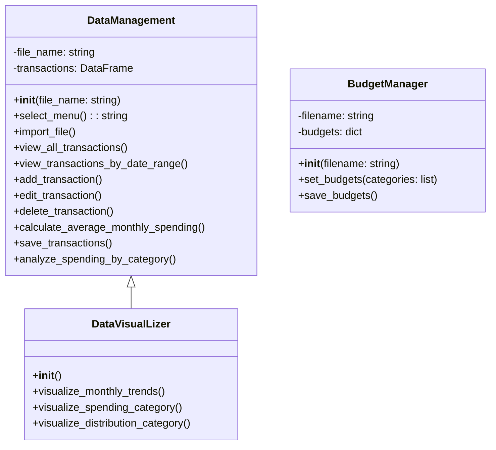

```mermaid
classDiagram
    class DataManagement {
        -file_name: string
        -transactions: DataFrame
        +__init__(file_name: string)
        +select_menu(): string
        +import_file()
        +view_all_transactions()
        +view_transactions_by_date_range()
        +add_transaction()
        +edit_transaction()
        +delete_transaction()
        +calculate_average_monthly_spending()
        +save_transactions()
        +analyze_spending_by_category()
    }

    class DataVisualLizer {
        +__init__()
        +visualize_monthly_trends()
        +visualize_spending_category()
        +visualize_distribution_category()
    }

    class BudgetManager {
        -filename: string
        -budgets: dict
        +__init__(filename: string)
        +set_budgets(categories: list)
        +save_budgets()
    }

    DataManagement <|-- DataVisualLizer
```